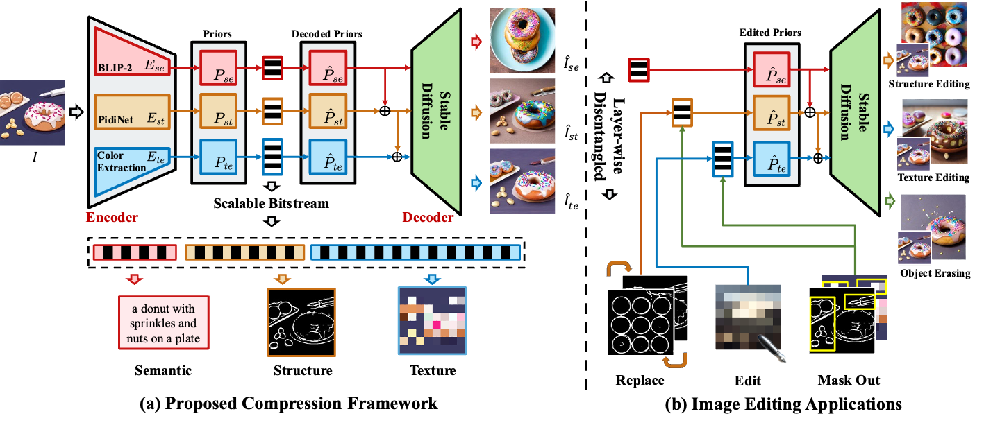

### Stable Diffusion is a Natural Cross-Modal Decoder for Layered AI-generated Image Compression  (DCC 2025)

This repository is the official implementation of *Stable Diffusion is a Natural Cross-Modal Decoder for Layered AI-generated Image Compression*.

[Ruijie Chen](https://deoxyribonucleic-acid.github.io/), [Qi Mao](https://sites.google.com/view/qi-mao/), [Zhengxue Cheng](https://medialab.sjtu.edu.cn/author/zhengxue-cheng/)

<!-- [](https://mag-edit.github.io/) -->
[](https://arxiv.org/abs/2412.12982)

<p align="center">
  
<br>


## Abstract
<b>TL; DR: We introduce a scalable cross-modal compression framework for AI-generated images that efficiently encodes semantic, structural, and texture information, achieving high-quality reconstruction at extremely low bitrates (<0.02 bpp).</b>

<details><summary>CLICK for the full abstract</summary>
Recent advances in Artificial Intelligence Generated Content (AIGC) have garnered significant interest, accompanied by an increasing need to transmit and compress the vast number of AI-generated images (AIGIs). However, there is a noticeable deficiency in research focused on compression methods for AIGIs. To address this critical gap, we introduce a scalable cross-modal compression framework that incorporates multiple human-comprehensible modalities, designed to efficiently capture and relay essential visual information for AIGIs. In particular, our framework encodes images into a layered bitstream consisting of a semantic layer that delivers high-level semantic information through text prompts; a structural layer that captures spatial details using edge or skeleton maps; and a texture layer that preserves local textures via a colormap. Utilizing Stable Diffusion as the backend, the framework effectively leverages these multimodal priors for image generation, effectively functioning as a decoder when these priors are encoded. Qualitative and quantitative results show that our method proficiently restores both semantic and visual details, competing against baseline approaches at extremely low bitrates (< 0.02 bpp). Additionally, our framework facilitates downstream editing applications without requiring full decoding, thereby paving a new direction for future research in AIGI compression.
</details>


## Installation
### Clone Repo
```bash
git clone https://github.com/CUC-MIPG/DiffusionCMC_for_AGIs.git
cd DiffusionCMC_for_AGIs/
```
### Create conda env and install PyTorch
```bash
conda create -n <NAME_OF_YOUR_ENV> python=3.9
conda activate <NAME_OF_YOUR_ENV>

# See https://pytorch.org/get-started/locally/ for installation with CUDA
pip3 install torch torchvision torchaudio
```
### Install required packages
```bash
pip install -r requirements.txt
```

## Run image compression
### Compression with edge map
To compress and reconstruct images with input images only, run:
```bash
python CMC_edge.py -i <PATH_TO_INPUT_IMAGES> \
                    -o <PATH_TO_OUTUT_IMAGES>
```
The result is saved at `<PATH_TO_OUTUT_IMAGES>`.

To reconstruct imags with pre-generated edge map or text prompts, run:
```bash
python CMC_edge.py -i <PATH_TO_INPUT_IMAGES> \
                    -o <PATH_TO_OUTUT_IMAGES> \
                    -t <PATH_TO_TEXT_FILES> \
                    -e <PATH_TO_EDGE_IMAGES>
```

### Compression with human keypoint
To compress and reconstruct images with input images only, run:
```bash
python CMC_skeleton.py -i <PATH_TO_INPUT_IMAGES> \
                    -o <PATH_TO_OUTUT_IMAGES>
```
The result is saved at `<PATH_TO_OUTUT_IMAGES>`.

To reconstruct imags with pre-generated keypoints or text prompts, run:
```bash
python CMC_skeleton.py -i <PATH_TO_INPUT_IMAGES> \
                    -o <PATH_TO_OUTUT_IMAGES> \
                    -t <PATH_TO_TEXT_FILES> \
                    -p <PATH_TO_KP_IMAGES>
```

## Run image editing
Run `editing.ipynb` for image editing task.

You might need to modify the paths for inputs and outputs in class `dirs`: 
```python
# replace with your paths
class dirs:
    def __init__(self) -> None:
        self.image_src = "PATH_TO_SOURCE_IMAGE"
        self.text_src = "PATHS_TO_TEXT_FILE"
        self.structure_src = [
            "PATHS_TO_STRUCTURE_IMAGES"
        ]
        self.color_src = [
            "PATHS_TO_COLOR_IMAGES"
        ]
        self.out_dir = "PATH_TO_OUTPUT_DIR"
```
This script uses edge maps as structure images by default. Specify ``self.use_skeleton = True`` in class `args` to use keypoints as structure images.

## Citation 

```
@misc{chen2024stablediffusionnaturalcrossmodal,
      title={Stable Diffusion is a Natural Cross-Modal Decoder for Layered AI-generated Image Compression}, 
      author={Ruijie Chen and Qi Mao and Zhengxue Cheng},
      year={2024},
      eprint={2412.12982},
      archivePrefix={arXiv},
      primaryClass={eess.IV},
      url={https://arxiv.org/abs/2412.12982}, 
}
``` 